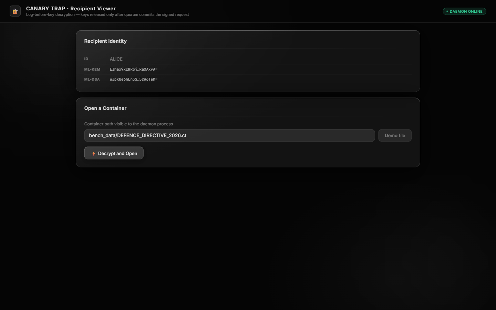
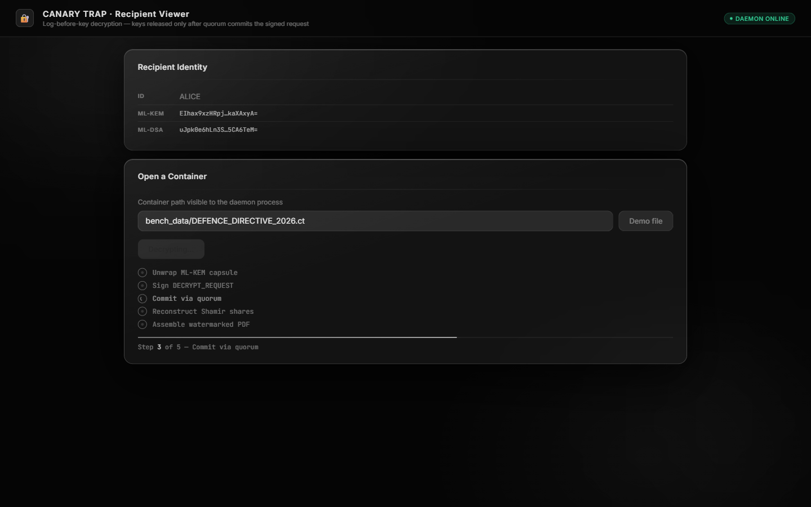

# CANARY TRAP

> **Why dont we make it simple?**

Post-quantum copy-attribution and decryption provenance for multi-recipient
document distribution. Target problem: Smart India Hackathon 2026, **SIH26237**
(Ministry of Defence). Fully offline and air-gapped: no cloud KMS, no public
blockchain, no network access at runtime. NIST post-quantum algorithms
(ML-KEM-768, ML-DSA-65).

---

## The idea

One document is encrypted **once** and handed to many recipients. Each recipient
decrypts a subtly different copy. If a copy leaks, the system must name the
recipient who decrypted it, with cryptographic evidence.

CANARY TRAP does this by never letting an unmarked plaintext exist:

1. **Encrypt once.** The sender splits the document into text blocks, renders
   each block in two variant streams (A/B), and encrypts every variant under its
   own single-use AES-256-GCM key.
2. **Wrap per recipient.** The outer content key `K_out` is wrapped to each
   recipient's ML-KEM-768 public key, so every recipient opens the same
   container with their own capsule.
3. **No log, no key.** A recipient must sign a `DECRYPT_REQUEST` with ML-DSA-65.
   The validator quorum validates identity, policy and quota, commits the request
   to a hash-chained ledger, and only then releases the Shamir shares for the
   variants selected by that session's codeword.
4. **The copy is the evidence.** The codeword is derived from the committed

### Demo Screenshots

````carousel

<!-- slide -->

<!-- slide -->

````

   ledger entry, so the recovered watermark points back at one specific
   committed decryption session.
5. **Prove it offline.** `hound/` builds a self-contained evidence bundle and
   `hound/verify.py` re-checks every signature and Merkle proof with zero
   network access.

---

## Repository layout

```
seal/       encryption, key wrapping, key management  (pqc_adapter, sharing, merkle, container)
warden/     signed requests, policy, key release       (policy, custody, consensus, service)
chronicle/  hash-chained ledger, Merkle proofs         (entry, schema, proofs, ledger)
dye/        watermark layers: text today               (text_layer, assembler, extractor, codeword)
hound/      attribution, exoneration, evidence bundles  (attribution, evidence, verify)
bridge/     recipient-facing FastAPI service            (session, service)
deck/       web UIs: deck/audit (cluster + forensics), deck/viewer (recipient)
gauntlet/   attack harness, benchmarks, demo fixtures
ct/         command-line tools
docs/       architecture, protocol, threat model, benchmarks, naming, rename map, roadmap
third_party/ third-party material, licence texts, reserved patch area
tests/      full pytest suite
```

Each package exposes at most one seam over an external library -
`seal/pqc_adapter.py` for post-quantum primitives, `dye/embedder_adapter.py`
for the text watermark channel - so a provider can be replaced without touching
the rest of the system. PyMuPDF is the exception: it is still imported directly
by `dye/text_layer.py`, `dye/assembler.py` and `dye/extractor.py`, and putting
it behind an adapter is tracked as debt in `docs/architecture.md` §6.
Module boundaries and the reasoning behind them: `docs/architecture.md`. Full
old-name to new-name record: `docs/RENAME_MAP.md`.

---

## Quickstart (offline)

```powershell
# 1. environment
py -3 -m venv .venv
.venv\Scripts\python.exe -m pip install -r requirements.txt

# 2. tests  (24 tests, all deterministic, no network)
.venv\Scripts\python.exe -m pytest

# 3. full end-to-end demo: distribute, decrypt, leak, attribute, verify offline,
#    then run the three attack scenarios
.venv\Scripts\python.exe gauntlet\demo.py

# 4. benchmark suite + scaling study
.venv\Scripts\python.exe gauntlet\benchmarks.py

# 5. distribute a real PDF to N recipients and attribute a leak
.venv\Scripts\python.exe gauntlet\distribution.py --pdf my.pdf --num-recipients 10 --leaker 7
```

`pytest` needs no setup (`pytest.ini` puts the repository root on the path).
The **scripts do**: they import the project packages as top-level modules, so
run them with the repository root on `PYTHONPATH`.

```powershell
$env:PYTHONPATH = "."
.venv\Scripts\python.exe gauntlet\demo.py
.venv\Scripts\python.exe -m hound.verify bench_data\EVIDENCE_BUNDLE.json
.venv\Scripts\python.exe -m ct.sender distribute --pdf doc.pdf --doc-id DOC_001 --recipients ALICE,BOB
```

### Services

The whole stack (4 validator nodes, recipient daemon, both web UIs) is started
detached by one script — services launched this way outlive the shell that
started them, and write their logs to `data/logs/`:

```powershell
.venv\Scripts\python.exe gauntlet\stack.py up          # nodes + daemon + UIs
.venv\Scripts\python.exe gauntlet\stack.py bootstrap   # identities + directive
.venv\Scripts\python.exe gauntlet\stack.py status      # what is answering, and which demo files exist
.venv\Scripts\python.exe gauntlet\stack.py down        # stop what `up` started
```

`bootstrap` is what makes the browser demo self-contained: it writes the
fixture, enrols `ALICE` through the recipient daemon and `SENDER_OFFICE` on the
ledger, then distributes `DEFENCE_DIRECTIVE_2026.ct` — built with
`ct/sender`, which resolves the recipient's ML-KEM key from the daemon's own key
directory, so the container is guaranteed to be openable there.

Then: `http://localhost:5174` for the audit console and `http://localhost:5173`
for the recipient viewer.

Launching services manually still works:

```powershell
# validator / quorum node  (one process per node; ports 8001-8004)
.venv\Scripts\python.exe -m uvicorn warden.service:app --host 127.0.0.1 --port 8001

# recipient daemon (holds recipient keys, mounts the viewer)
.venv\Scripts\python.exe -m uvicorn bridge.service:app --host 127.0.0.1 --port 5001
```

Then `http://127.0.0.1:8001/console/` for the audit console and
`http://127.0.0.1:5001/` for the recipient portal (both need `npm run build` in
`deck/audit` and `deck/viewer`).

### Command line

```powershell
.venv\Scripts\python.exe -m ct.sender distribute --pdf doc.pdf --doc-id DOC_001 --recipients ALICE,BOB
.venv\Scripts\python.exe -m hound.verify EVIDENCE_BUNDLE.json
```

---

## Cryptographic primitives

| Function                | Primitive                                               | Standard        | Sizes                              |
| ----------------------- | ------------------------------------------------------- | --------------- | ---------------------------------- |
| Key encapsulation       | ML-KEM-768                                              | NIST FIPS 203   | ek 1184 B, ct 1088 B, secret 32 B  |
| Digital signatures      | ML-DSA-65                                               | NIST FIPS 204   | vk 1952 B, signature 3309 B        |
| Symmetric encryption    | AES-256-GCM                                             | NIST SP 800-38D | key 32 B, nonce 12 B, tag 16 B     |
| Secret sharing          | Shamir over `F_p`, `p = 2^256 + 297`                    | —               | `(t=3, n=4)`, 33-byte share values |
| Hashing                 | SHA3-256                                                | NIST FIPS 202   | 32 B                               |
| Merkle log              | binary tree, domain separated `0x00` leaf / `0x01` node | RFC 9162 style  | `O(log n)` inclusion proof         |
| Canonical serialization | key-sorted JSON, no whitespace                          | RFC 8785 style  | —                                  |

`p = 2^256 + 297` is the smallest prime greater than `2^256`, so every 32-byte
AES key maps into the field with no rejection sampling and no wrap-around.

Providers behind `seal/pqc_adapter.py` are `kyber-py` and `dilithium-py` (MIT OR
Apache-2.0). Both are explicitly educational libraries with no side-channel
hardening — `seal/pqc_adapter.py` is the single swap point for a hardened
provider. See `THIRD_PARTY.md` §2.1.

---

## Verification

```powershell
.venv\Scripts\python.exe -m pytest          # expect: 24 passed
```

`tests/test_live_cluster_bft.py` binds the fixed peer ports (8001–8004) on
purpose, so if the live stack from `gauntlet/stack.py up` is running it skips
with an explanatory message rather than silently testing the wrong cluster:
with the stack up the suite reports **23 passed, 1 skipped**, with the stack
down **24 passed**.

Evidence bundles are verified with zero network access:

```powershell
.venv\Scripts\python.exe -m hound.verify path\to\EVIDENCE_BUNDLE.json
```

Checks performed, in order: recipient ML-DSA-65 signature (non-repudiation),
recomputed session entry hash, Merkle inclusion proof against the block root,
validator quorum signatures, and the statistical attribution threshold.

---

## Honest status

This is a hackathon prototype, not a production system. The following are known
limitations of the **current implementation** and are documented, not hidden.
They are listed so nobody is surprised under questioning.

1. **The quorum threshold is not enforced.** `warden/consensus.py` collects peer
   votes but a block is still committed when fewer than three signatures are
   gathered (the missing-vote branch is a no-op), so a single reachable node can
   commit. The 4-node cluster and its fault tolerance are real; the enforcement
   of `≥3-of-4` is not yet implemented.
2. **Manifest signatures are stored but not verified.** `warden/service.py` accepts a
   `MANIFEST` without checking the sender's ML-DSA-65 signature, unlike
   `ENROLL` and `DECRYPT_REQUEST`, which are verified.
3. **Quorum certificates are not yet uniformly defined.** The proposer signs a
   candidate header, while the offline verifier checks block signatures against
   the block hash, and treats a signature with no accompanying public key as
   valid. Evidence bundles therefore prove the recipient's non-repudiation
   strongly, and the quorum layer weakly.
4. **Shamir shares are stored in cleartext.** The `key_shares.encrypted_share`
   column holds base64-encoded share bytes, not ciphertext.
5. **Watermark extraction strategy 1 reads the ground truth.** It regex-reads
   `Tw` operators out of the PDF content stream, so it reports full confidence on
   documents that still contain them. Strategy 2 (geometric measurement) is the
   one that survives re-rendering, and it is the weaker of the two.
6. **The viewer relies on the browser's PDF renderer**, not a bundled PDF
   renderer, so the recipient must use a browser with native PDF support.
7. **If a recipient's public key is missing locally, `ct/sender.py` generates a
   throwaway key** so the demo can continue; that recipient then cannot decrypt.
8. **The watermark is typographic.** Robustness to print-and-scan or to document
   re-typesetting is not implemented; error-correcting codes (Reed-Solomon) are
   the planned mitigation.
9. **The codeword length is a shared parameter, not a signed field.**
   `ct/sender --lines-per-block` must match what the attributor assumes
   (`hound/attribution.py`, `warden/service.py` and the audit console all
   default to 1). If they disagree, extraction compares the wrong number of
   bits and the watermark gate correctly returns `NO_WATERMARK_DETECTED`
   rather than a wrong accusation — a safe failure, but it needs the operator
   to keep them aligned. The 24-line demo fixture at 1 line per block clears
   the gate with p = 6.14e-06.

Remediation order and scope are tracked in `docs/architecture.md` §7.

---

## Licensing and attribution

- CANARY TRAP's own code: see `LICENSE`.
- Every third-party component, version, licence and purpose: `THIRD_PARTY.md`.
- How this tree was derived from the earlier workspace, with file-level evidence:
  `docs/RENAME_MAP.md` (every old name, its replacement, file by file) and
  `THIRD_PARTY.md` §1.
